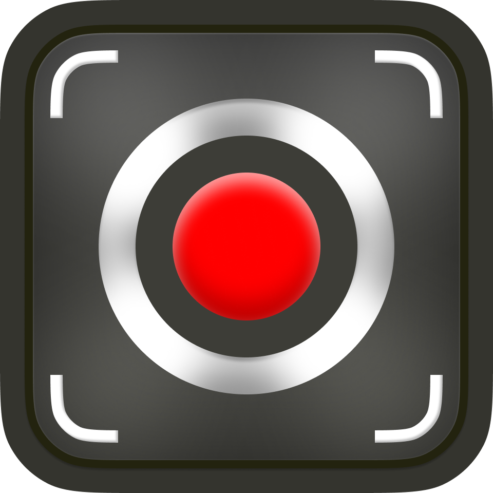
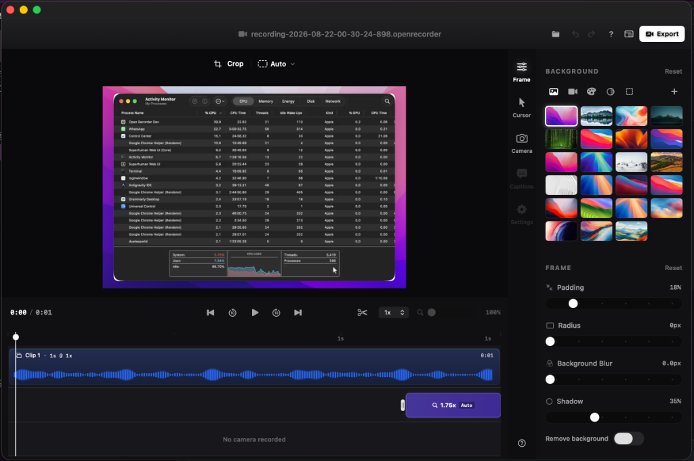

# Open Recorder

<p align="center">
  
</p>

<p align="center">
  
  
  
</p>

<p align="center">
  
</p>

Open Recorder is a macOS-only screen recorder, screenshot tool, and lightweight editor built as a native Swift app backed by a Rust service.

The product uses a small native stack: Swift owns the macOS experience, capture UI, recording controls, screenshot flow, playback, and Finder/privacy integrations. Rust owns durable local service work such as app paths, project metadata, recording registration, screenshot indexing, and export bookkeeping.

## Features

- Record a display, window, or interactive selected area on macOS
- Capture screenshots from displays, windows, or selected areas
- Choose microphone input, system audio, camera capture, cursor visibility, and click recording before capture
- Record a facecam overlay from built-in cameras, external cameras, iPhone Continuity Camera, or Desk View cameras, and switch devices with **Change Camera...** in the capture HUD
- Save recordings under `~/Movies/Open Recorder`
- Save screenshots under `~/Pictures/Open Recorder`
- Automatically create `.openrecorder` project metadata
- Browse projects in the native project library
- Preview recordings with the native AVKit player
- Export recordings through the Rust service
- Open Screen Recording privacy settings from inside the app

## Editor Capabilities

Open Recorder includes a native editor for turning raw captures into shareable videos and screenshots without leaving the app.

### Video Editor

- **Backgrounds** - place recordings on transparent, solid color, gradient, or bundled wallpaper backgrounds.
- **Framing** - adjust stage padding, background blur, shadow strength, and recording corner roundness.
- **Inset styling** - add an inset treatment around the recording with configurable amount, color, opacity, and balance.
- **Crop and aspect controls** - crop recordings visually and preview/export them in automatic or fixed aspect layouts.
- **Cursor overlays** - show or hide the captured cursor path, loop cursor motion, tune cursor size and smoothing, and choose from system, touch, and emphasis cursor styles.
- **Timeline playback** - use transport controls, frame stepping, hover scrubbing, preview speed controls, and timeline zooming while editing.
- **Zoom sections** - add manual zoom regions from the timeline, set zoom depth, and adjust X/Y focus. Adaptive automatic zoom groups recorded pointer interactions, fits magnification to their context, and plans smooth pans. Set Maximum zoom in Settings; regeneration preserves manual and edited regions. See [automatic zoom](docs/automatic-zoom.md).
- **Clip splitting and speed changes** - split the recording at the playhead, select clips, set clip speeds from 1x to 2x, merge adjacent split points, and delete selected clips while preserving at least one playable segment.
- **Camera clips** - when a camera track was recorded, split the camera layer independently, show or hide camera segments, place the facecam in a 3x3 position grid, and adjust camera size and border width per segment.
- **Autosaved edits** - video styling, crop selection, cursor settings, facecam settings, and timeline edits are saved into the `.openrecorder` project metadata.

### Screenshot Editor

- **Composed screenshots** - place screenshots on the same background system used by the video editor.
- **Layer styling** - adjust background padding, background roundness, background shadow, image roundness, and image shadow separately.
- **PNG output** - export the composed screenshot to a file or copy it directly to the clipboard.
- **Project persistence** - screenshot styling is autosaved with the project so the composition can be reopened later.

### Export

- Export styled video projects as MOV or MP4 files, or as animated GIFs.
- Choose 480p, 720p, 1080p, or 4K output presets for movie exports.
- Choose Low, Medium, or High MP4 quality presets.
- Choose Medium, Large, or Original GIF sizing, 15/20/25/30 FPS, and looping behavior.
- Exported videos and GIFs include the selected crop, background styling, inset styling, cursor overlay, timeline speed/deletion edits, zoom effects, and camera clip settings.

## Repository Layout

- `apps/macos` - native SwiftUI macOS app
- `apps/rust-service` - Rust JSON-lines service and one-shot command backend
- `apps/landing` - Next.js landing page for the project

## Build From Source

Requirements:

- macOS
- Xcode command line tools with Swift 6.2+
- Rust 1.93+

Install locked JavaScript dependencies and prefetch Rust crates:

```bash
pnpm run setup
```

Build everything:

```bash
make build-macos
```

Package a local `.app` bundle:

```bash
make package-macos
```

Run the native app:

```bash
make dev-macos
```

Development runs as a separate macOS app:

- `make dev-macos` builds, installs, and launches `/Applications/Open Recorder Dev.app`
- The development bundle identifier is `dev.openrecorder.app.dev`
- Production packaging remains `/Applications/Open Recorder.app` with bundle identifier `dev.openrecorder.app`
- Script entrypoints spell out their role: development scripts use `development`, production/release scripts use `production`, and shared helpers use `shared`.
- Development signing prefers a real development certificate when one is available. Without one, the dev bundle is ad-hoc signed with a stable designated requirement for `dev.openrecorder.app.dev`, so macOS privacy grants are not pinned to each rebuilt executable hash.

This keeps development and production installs from sharing macOS app identity, window state, and privacy permission records.

Run verification:

```bash
make test-macos
```

The root `pnpm dev`, `pnpm build`, and `pnpm test` aliases call those same macOS Swift/Rust targets.

Run the landing page locally:

```bash
pnpm dev:landing
```

## Rust Service Protocol

The Rust service can run as a long-lived JSON-lines process:

```bash
printf '%s\n' '{"id":1,"method":"health","params":{}}' | apps/rust-service/target/debug/open-recorder-service
```

It also supports one-shot calls used by the Swift app:

```bash
apps/rust-service/target/debug/open-recorder-service --oneshot paths '{}'
```

Primary methods:

- `health`
- `paths`
- `prepareRecordingFile`
- `registerRecording`
- `saveProject`
- `listProjects`
- `loadProject`
- `forgetProject`
- `rememberScreenshot`
- `exportRecording`

## macOS Permissions

Screen recording requires macOS Screen Recording permission for the app process. In development, the Swift app can open the relevant privacy pane from Settings. After granting access, restart the app so macOS refreshes the permission state.

## Contributors

[View the current contributor graph.](https://github.com/imbhargav5/open-recorder/graphs/contributors)

Thanks to everyone who has contributed to Open Recorder. The historical acknowledgements below use the [All Contributors emoji key](https://allcontributors.org/docs/en/emoji-key); the contributor graph above is the current record.

<details>
<summary>View historical acknowledgements</summary>

<!-- ALL-CONTRIBUTORS-LIST:START - Do not remove or modify this section -->
<!-- prettier-ignore-start -->
<!-- markdownlint-disable -->
<table>
  <tbody>
    <tr>
      <td align="center" valign="top" width="14.28%"><a href="https://github.com/imbhargav5"><br /><sub><b>Bhargav Ponnapalli</b></sub></a><br /><a href="https://github.com/imbhargav5/open-recorder/commits?author=imbhargav5" title="Code">💻</a> <a href="#maintenance-imbhargav5" title="Maintenance">🚧</a> <a href="#design-imbhargav5" title="Design">🎨</a> <a href="https://github.com/imbhargav5/open-recorder/commits?author=imbhargav5" title="Documentation">📖</a></td>
      <td align="center" valign="top" width="14.28%"><a href="https://github.com/Arushi-Gupta13"><br /><sub><b>Arushi Gupta</b></sub></a><br /><a href="https://github.com/imbhargav5/open-recorder/commits?author=Arushi-Gupta13" title="Code">💻</a> <a href="#maintenance-Arushi-Gupta13" title="Maintenance">🚧</a> <a href="#design-Arushi-Gupta13" title="Design">🎨</a> <a href="https://github.com/imbhargav5/open-recorder/commits?author=Arushi-Gupta13" title="Documentation">📖</a></td>
      <td align="center" valign="top" width="14.28%"><a href="https://github.com/siddharthvaddem"><br /><sub><b>Siddharth Vaddem</b></sub></a><br /><a href="https://github.com/imbhargav5/open-recorder/commits?author=siddharthvaddem" title="Code">💻</a></td>
      <td align="center" valign="top" width="14.28%"><a href="https://github.com/psiddharthdesign"><br /><sub><b>Siddharth Ponnapalli</b></sub></a><br /><a href="https://github.com/imbhargav5/open-recorder/commits?author=psiddharthdesign" title="Code">💻</a> <a href="#design-psiddharthdesign" title="Design">🎨</a></td>
      <td align="center" valign="top" width="14.28%"><a href="https://github.com/ilGianfri"><br /><sub><b>Alessandro Spisso</b></sub></a><br /><a href="https://github.com/imbhargav5/open-recorder/commits?author=ilGianfri" title="Code">💻</a></td>
      <td align="center" valign="top" width="14.28%"><a href="https://github.com/KoopaCode"><br /><sub><b>Andrew P. Harper</b></sub></a><br /><a href="https://github.com/imbhargav5/open-recorder/commits?author=KoopaCode" title="Code">💻</a></td>
      <td align="center" valign="top" width="14.28%"><a href="https://github.com/ateendra24"><br /><sub><b>AP Solanki</b></sub></a><br /><a href="https://github.com/imbhargav5/open-recorder/commits?author=ateendra24" title="Code">💻</a></td>
    </tr>
    <tr>
      <td align="center" valign="top" width="14.28%"><a href="https://github.com/JustinBenito"><br /><sub><b>Justin Benito B</b></sub></a><br /><a href="https://github.com/imbhargav5/open-recorder/commits?author=JustinBenito" title="Code">💻</a></td>
      <td align="center" valign="top" width="14.28%"><a href="https://github.com/nikhilsolanki1403"><br /><sub><b>Nikhil Solanki</b></sub></a><br /><a href="https://github.com/imbhargav5/open-recorder/commits?author=nikhilsolanki1403" title="Code">💻</a></td>
      <td align="center" valign="top" width="14.28%"><a href="https://github.com/windholyghost"><br /><sub><b>Felipe Novaes F Rocha</b></sub></a><br /><a href="https://github.com/imbhargav5/open-recorder/commits?author=windholyghost" title="Code">💻</a></td>
      <td align="center" valign="top" width="14.28%"><a href="https://github.com/noorsoltan40"><br /><sub><b>NureddinSoltan</b></sub></a><br /><a href="https://github.com/imbhargav5/open-recorder/commits?author=noorsoltan40" title="Code">💻</a></td>
      <td align="center" valign="top" width="14.28%"><a href="https://github.com/marcgabe15"><br /><sub><b>Marc Diaz</b></sub></a><br /><a href="https://github.com/imbhargav5/open-recorder/commits?author=marcgabe15" title="Code">💻</a></td>
      <td align="center" valign="top" width="14.28%"><a href="https://github.com/idris-gadi"><br /><sub><b>Idris Gadi</b></sub></a><br /><a href="https://github.com/imbhargav5/open-recorder/commits?author=idris-gadi" title="Code">💻</a></td>
      <td align="center" valign="top" width="14.28%"><a href="https://github.com/suenyiyang"><br /><sub><b>Yiyang Suen</b></sub></a><br /><a href="https://github.com/imbhargav5/open-recorder/commits?author=suenyiyang" title="Code">💻</a></td>
    </tr>
    <tr>
      <td align="center" valign="top" width="14.28%"><a href="https://github.com/LauZzL"><br /><sub><b>LauZzL</b></sub></a><br /><a href="https://github.com/imbhargav5/open-recorder/commits?author=LauZzL" title="Code">💻</a></td>
      <td align="center" valign="top" width="14.28%"><a href="https://github.com/FlyingThaCat"><br /><sub><b>john</b></sub></a><br /><a href="https://github.com/imbhargav5/open-recorder/commits?author=FlyingThaCat" title="Code">💻</a></td>
      <td align="center" valign="top" width="14.28%"><a href="https://github.com/dankestmirror"><br /><sub><b>Kilian</b></sub></a><br /><a href="https://github.com/imbhargav5/open-recorder/commits?author=dankestmirror" title="Code">💻</a></td>
      <td align="center" valign="top" width="14.28%"><a href="https://github.com/webadderall"><br /><sub><b>webadderall</b></sub></a><br /><a href="https://github.com/imbhargav5/open-recorder/commits?author=webadderall" title="Code">💻</a></td>
    </tr>
  </tbody>
</table>

<!-- markdownlint-restore -->
<!-- prettier-ignore-end -->

<!-- ALL-CONTRIBUTORS-LIST:END -->

</details>

## License

Open Recorder is licensed under the Apache License 2.0.

### Download a signed nightly app from GitHub (recommended)

In GitHub, open **Actions → Build Nightly macOS App → Run workflow**, select the
branch to build, and start the run. Once both architecture jobs finish, download
`OpenRecorderNightly-arm64-…` for Apple Silicon or `OpenRecorderNightly-x64-…` for
Intel from the run's **Artifacts** section. Extract the downloaded artifact, then
extract the app ZIP inside it and move `OpenRecorderNightly.app` to Applications.
Quit an existing nightly instance before replacing it.

The workflow reuses the production signing and Apple notarization secrets already
configured in GitHub. It does not require signing credentials on your Mac. Each
artifact contains a notarized, stapled app, build commit metadata, and a ZIP
checksum; downloads are retained for 30 days. The workflow runs manually and
neither creates a GitHub release nor changes the production appcast. GitHub only
builds committed code on the selected remote branch, not uncommitted local edits.
The workflow must be merged into the default branch before its Run workflow
button becomes available.

### Signed local nightly app (optional)


`make run-macos-nightly` builds, Developer ID signs, notarizes, staples, installs,
and launches `/Applications/OpenRecorderNightly.app`. Use
`make package-macos-nightly` to produce only the bundle, or
`make install-macos-nightly` to install without launching. Each invocation builds
from the current checkout, including local changes, using an optimized release build.
Quit nightly before replacing its installed bundle.

One-time setup on your Mac:

1. Import your **Developer ID Application** certificate **and private key** into
   Keychain Access (a `.p12` export from the signing Mac, or create a Developer ID
   certificate through your Apple Developer account). An Apple Development
   certificate is insufficient for this workflow.
2. Confirm it appears in `security find-identity -v -p codesigning`.
3. Run `xcrun notarytool store-credentials OpenRecorderNightly` and follow its
   interactive prompts for your Apple ID, team ID, and app-specific password.
   Credentials stay in Keychain; do not commit or paste them into source files.
4. Run `make run-macos-nightly`.

If multiple Developer ID identities exist, select the intended certificate with
`CODE_SIGN_IDENTITY`. A non-default signing keychain can be selected with
`OPEN_RECORDER_SIGNING_KEYCHAIN`; a different notarization profile with
`OPEN_RECORDER_NOTARY_PROFILE`. Nightly refuses missing signing credentials and
never falls back to ad-hoc signing. Installation happens only after signature,
notarization ticket, and Gatekeeper checks pass. Notarization requires internet.

Nightly uses bundle ID `dev.openrecorder.app.nightly`, separate preferences and
privacy grants, and `OpenRecorderNightly` folders under Application Support,
Movies, and Pictures. No production library is copied or migrated. Global
shortcuts start disabled; configure nonconflicting shortcuts in Settings if needed.
Nightly has no automatic updates or default project-file association; use its
in-app Open command to deliberately open a project. Opening the same project in
both apps still means editing the same file.

Both updated variants exclude their own app from capture while allowing the
other variant. Nightly can record an older production app immediately; production
can record nightly after production receives the capture-exclusion fix. The
nightly command never replaces production or the existing Dev installation.

macOS will still ask for nightly's own screen-recording, microphone, and camera
permissions when those features are first used, and may show OS-mandated reminders.
Keep the bundle identity and signing identity consistent across rebuilds. Signing
and notarization establish app trust; they do not bypass privacy consent.
